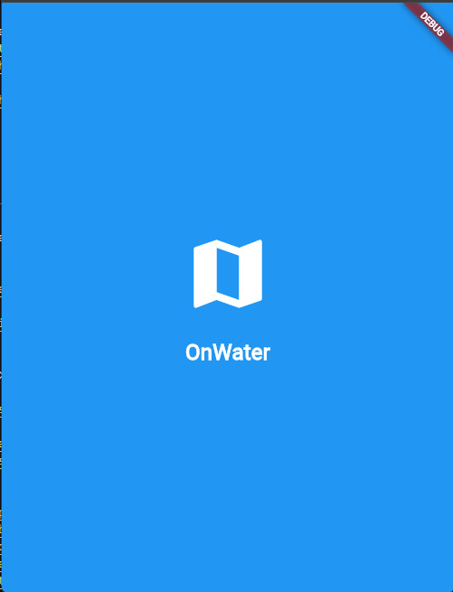
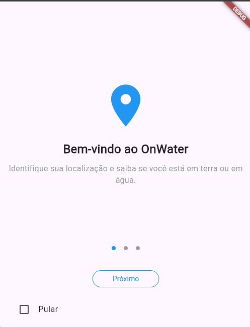
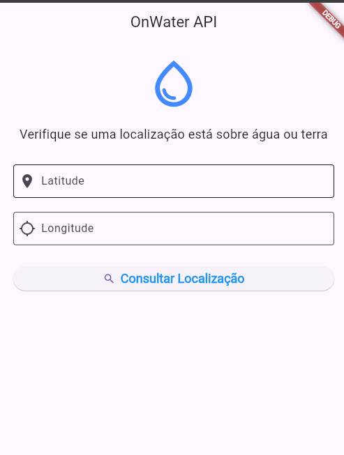
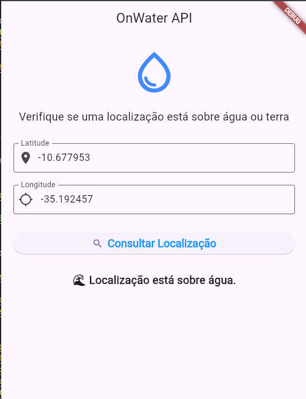
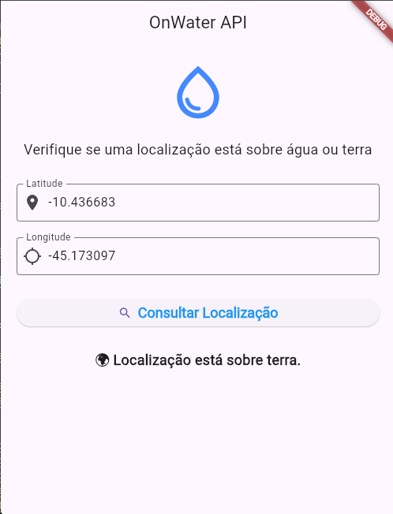
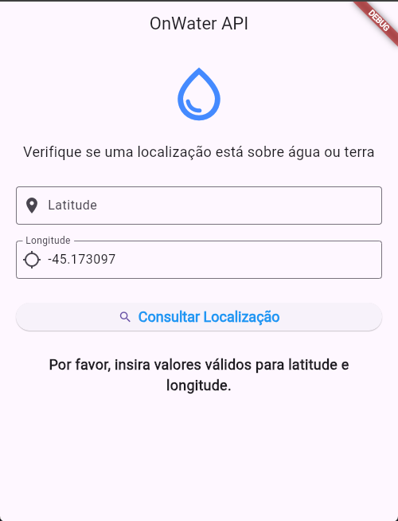

<!-- Improved compatibility of back to top link: See: https://github.com/othneildrew/Best-README-Template/pull/73 -->
<a name="top"></a>
<!--
*** Thanks for checking out the Best-README-Template. If you have a suggestion
*** that would make this better, please fork the repo and create a pull request
*** or simply open an issue with the tag "enhancement".
*** Don't forget to give the project a star!
*** Thanks again! Now go create something AMAZING! :D
-->


<!-- PROJECT SHIELDS -->
<!--
*** I'm using markdown "reference style" links for readability.
*** Reference links are enclosed in brackets [ ] instead of parentheses ( ).
*** See the bottom of this document for the declaration of the reference variables
*** for contributors-url, forks-url, etc. This is an optional, concise syntax you may use.
*** https://www.markdownguide.org/basic-syntax/#reference-style-links
-->
[![Contributors][contributors-shield]][contributors-url]
[![Forks][forks-shield]][forks-url]
[![Stargazers][stars-shield]][stars-url]
[![Issues][issues-shield]][issues-url]
[![MIT License][license-shield]][license-url]
[![LinkedIn][linkedin-shield]][linkedin-url]


<!-- PROJECT LOGO -->
<br/>
<div align="center">
  <h3 align="center">Is It Water? App</h3>
  <p align="center">
    A Flutter app to determine if coordinates are on water or land using 
    <a href="https://isitwater.com/">IsItWater API</a>.
    <br/>
    <a href="https://github.com/HeitorLouzeiroRepositoryIFPI/flutter-on-water-app/issues">Report Bug</a>
    ·
    <a href="https://github.com/HeitorLouzeiroRepositoryIFPI/flutter-on-water-app/issues">Request Feature</a>
    ·
    <a href="https://youtu.be/adQQ8gmf-d0">Youtube Video</a>
  </p>
</div>


<!-- TABLE OF CONTENTS -->
<details>
  <summary>Table of Contents</summary>
  <ol>
    <li>
      <a href="#about-the-project">About The Project</a>
      <ul>
        <li><a href="#built-with">Built With</a></li>
      </ul>
    </li>
    <li><a href="#usage">Usage</a></li>
    <li>
      <a href="#getting-started">Getting Started</a>
      <ul>
        <li><a href="#prerequisites">Prerequisites</a></li>
        <li><a href="#installation">Installation</a></li>
      </ul>
    </li>
    <li><a href="#roadmap">Roadmap</a></li>
    <li><a href="#contributing">Contributing</a></li>
    <li><a href="#collaborators">Collaborators</a></li>
    <li><a href="#license">License</a></li>
    <li><a href="#contact">Contact</a></li>
    <li><a href="#acknowledgments">Acknowledgments</a></li>
  </ol>
</details>


<!-- ABOUT THE PROJECT -->
## About The Project

<p align="right">(<a href="#top">back to top</a>)</p>


**Is It Water? App** is a mobile application built with Flutter that answers a simple but critical question: *"Is this coordinate on land or water?"* It leverages the [IsItWater API](https://isitwater.com/), which uses high-resolution data from **OpenStreetMap** for accurate results. 

Key highlights:
- **Instant Verification**: Check via manual input.
- **Reliable Data**: Updated regularly with isitwater datasets.
- **Lightweight**: Optimized for fast performance on iOS and Android.
- **Open Source**: Community-driven improvements are welcome!

<p align="right">(<a href="#top">back to top</a>)</p>

<!-- FEATURES -->
## Features

- 🌍 **Coordinate Check**: Enter latitude/longitude.
- ⚡ **Fast API Integration**: Real-time results via IsItWater API.
- 📱 **Cross-Platform**: Works seamlessly on Android and iOS.

<p align="right">(<a href="#top">back to top</a>)</p>

## Built With

[![Flutter][Flutter-shield]][Flutter-url]
[![Dart][Dart-shield]][Dart-url]
[![IsItWater API][api-shield]][api-url]

- **Frontend**: Flutter (iOS/Android)
- **API Integration**: `http` package.
- **Flutter Dotenv**: Environment variables.
- **Local Storage**: Hive/SharedPreferences.
- **Smooth page indicator**: Onboarding Page.


<p align="right">(<a href="#top">back to top</a>)</p>


<!-- USAGE EXAMPLES -->
## Usage
### 1.Splash page.

<p align="center">
      
    <br/>
</p>

### 2.Onboading page.

<p align="center">
      
    <br/>
</p>

### 2.Home page.

<p align="center">
      
    <br/>
</p>

### 3.Location in the water.

<p align="center">
      
    <br/>
</p>

### 4.Location in the earth.

<p align="center">
      
    <br/>
</p>

### 5.Null data.

<p align="center">
      
    <br/>
</p>

<p align="right">(<a href="#top">back to top</a>)</p>

### Prerequisites

* [Flutter](https://flutter.dev/)

<!-- GETTING STARTED -->
## Getting Started
### Installation

1. Clone the repo
   ```sh
   git clone https://github.com/HeitorLouzeiroRepositoryIFPI/flutter-on-water-app.git
   ```
2. Access the project folder in terminal/cmd
   ```sh
   cd flutter-on-water-app
   ```
   ·
   ```sh
    cd on_water_app
   ```
    OR
   ```sh
    cd flutter-on-water-app/on_water_app
   ```

3. Run flutter in terminal.

  ```sh
    flutter run
  ```
4. Choose options to run on your computer.

 - Windows
 - Chrome
 - Edge

<p align="right">(<a href="#top">back to top</a>)</p>


<!-- ROADMAP -->
## Roadmap

- [x] Splash Page.
- [x] Onboarding Screen.
- [x] Om Water Screen.


See the [open issues](https://github.com/HeitorLouzeiroRepositoryIFPI/flutter-on-water-app/issues) for a full list of proposed features (and known issues).

<p align="right">(<a href="#top">back to top</a>)</p>

<!-- CONTRIBUTING -->
## Contributing

Contributions are what make the open source community such an amazing place to learn, inspire, and create. Any contributions you make are **greatly appreciated**.

If you have a suggestion that would make this better, please fork the repo and create a pull request. You can also simply open an issue with the tag "enhancement".
Don't forget to give the project a star! Thanks again!

1. Fork the Project
2. Create your Feature Branch (`git checkout -b feature/Improvements`)
3. Commit your Changes (`git commit -m 'Add my new Enhancements'`)
4. Push to the Branch (`git push origin feature/Improvements`)
5. Open a Pull Request

<p align="right">(<a href="#top">back to top</a>)</p>

## Collaborators

We thank the following people who contributed to this project:

<table>
  <tr>
    <td align="center">
      <a href="#">
        <br>
        <sub>
          <b>Heitor Louzeiro</b>
        </sub>
      </a>
    </td>
  </tr>
</table>

<p align="right">(<a href="#top">back to top</a>)</p>


<!-- LICENSE -->
## License

Distributed under the MIT License. See [LICENSE](LICENSE) for more information.

<p align="right">(<a href="#top">back to top</a>)</p>


<!-- CONTACT -->
## Contact

<div align='center'>  
  <a href="https://www.instagram.com/heitorlouzeiro/" target="_blank">
    
  </a> 
  <a href = "mailto:heitorlouzeirodev@gmail.com">
        
  </a>
  <a href="https://www.linkedin.com/in/heitor-louzeiro/" target="_blank">
    
  </a> 
</div>

Project Link: [https://github.com/HeitorLouzeiroRepositoryIFPI/flutter-on-water-app](https://github.com/HeitorLouzeiroRepositoryIFPI/flutter-on-water-app)

<p align="right">(<a href="#top">back to top</a>)</p>

<!-- ACKNOWLEDGMENTS -->
## Acknowledgments

- [IsItWater API](https://isitwater.com/) for geospatial data
- [Flutter Community](https://flutter.dev/) for tools and support.


<!-- MARKDOWN LINKS & IMAGES -->
<!-- https://www.markdownguide.org/basic-syntax/#reference-style-links -->
[contributors-shield]: https://img.shields.io/github/contributors/HeitorLouzeiroRepositoryIFPI/flutter-on-water-app.svg?style=for-the-badge
[contributors-url]: https://github.com/HeitorLouzeiroRepositoryIFPI/flutter-on-water-app/graphs/contributors
[forks-shield]: https://img.shields.io/github/forks/HeitorLouzeiroRepositoryIFPI/flutter-on-water-app.svg?style=for-the-badge
[forks-url]: https://github.com/HeitorLouzeiroRepositoryIFPI/flutter-on-water-app/network/members
[stars-shield]: https://img.shields.io/github/stars/HeitorLouzeiroRepositoryIFPI/flutter-on-water-app.svg?style=for-the-badge
[stars-url]: https://github.com/HeitorLouzeiroRepositoryIFPI/flutter-on-water-app/stargazers
[issues-shield]: https://img.shields.io/github/issues/HeitorLouzeiroRepositoryIFPI/flutter-on-water-app.svg?style=for-the-badge
[issues-url]: https://github.com/HeitorLouzeiroRepositoryIFPI/flutter-on-water-app/issues
[license-shield]: https://img.shields.io/github/license/HeitorLouzeiroRepositoryIFPI/flutter-on-water-app.svg?style=for-the-badge
[license-url]: https://github.com/HeitorLouzeiroRepositoryIFPI/flutter-on-water-app/blob/master/license
[linkedin-shield]: https://img.shields.io/badge/-LinkedIn-black.svg?style=for-the-badge&logo=linkedin&colorB=555
[linkedin-url]: https://linkedin.com/in/heitor-louzeiro

[Flutter-shield]: https://img.shields.io/badge/Flutter-02569B?style=for-the-badge&logo=flutter&logoColor=white
[Flutter-url]: https://flutter.dev

[Dart-shield]: https://img.shields.io/badge/Dart-0175C2?style=for-the-badge&logo=dart&logoColor=white
[Dart-url]: https://dart.dev

[api-shield]: https://img.shields.io/badge/API-IsItWater-blue?style=for-the-badge

[api-url]: https://isitwater.com